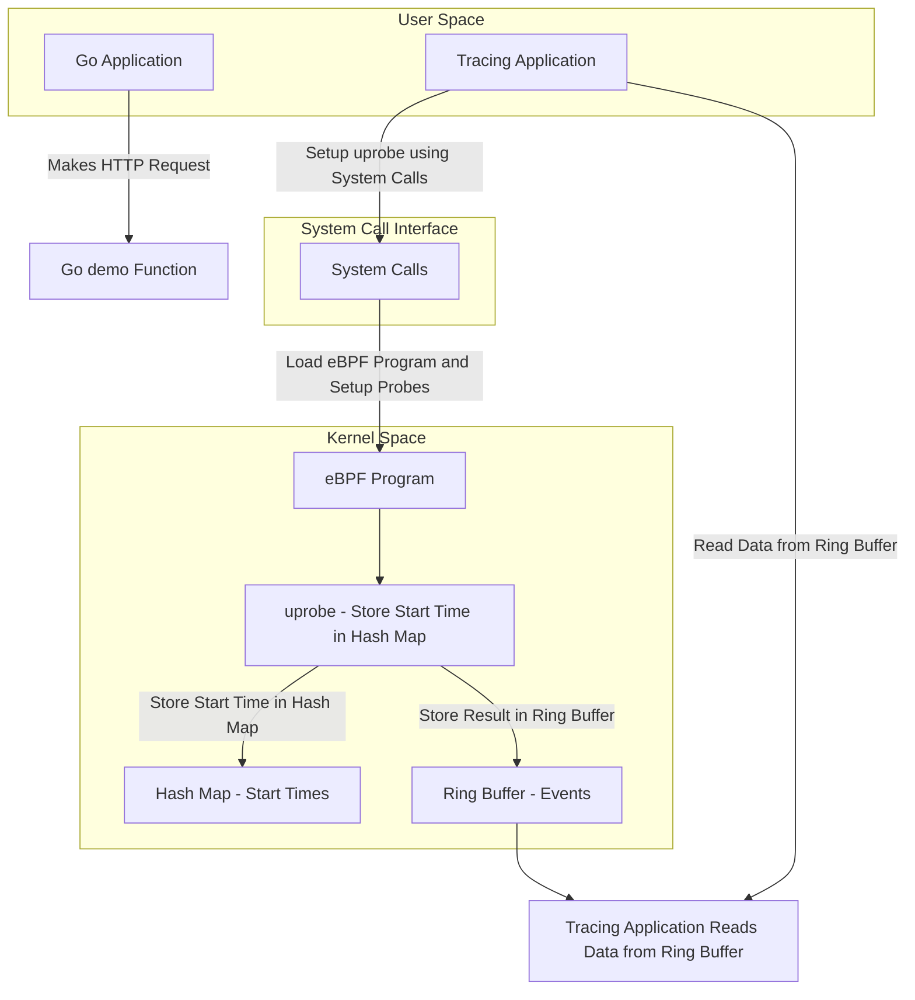

# Cilium eBPF Demos

This repository contains multiple demos showcasing the usage of eBPF with Cilium for Go applications. Each demo is designed to highlight different aspects of eBPF and its interaction with Go applications, including uProbes, uRetprobes, and function execution time tracking.

## Overview
Each folder within this repository contains a specific demo illustrating a unique feature of eBPF and its integration with Go applications. The demos include:
1. [Overview](#overview)
2. [How Kernel Space and User Space Interacts in this examples](#how-kernel-space-and-user-space-interacts-in-this-examples)
3. [Useful Resources](#useful-resources)

For more details on each demo, please refer to the README file within the respective demo folder.

## How Kernel Space and User Space Interacts in this examples

## Useful Resources
Here are some useful resources to understand eBPF, Go, and their integration:
- [Great Medium Article on BPF and Go](https://medium.com/bumble-tech/bpf-and-go-modern-forms-of-introspection-in-linux-6b9802682223)
- [Liz Rice's Talk on eBPF](https://www.youtube.com/watch?v=Hed2DOrk_kk)
- [Pixie Demo on eBPF](https://github.com/pixie-io/pixie-demos/tree/main/simple-gotracing)
- [Cilium eBPF Documentation](https://ebpf-go.dev)
- [Series of good blog posts](https://intelops.ai/learning-center/2-learn-ebpf/)
- [List of BPF helper functions](https://ebpf-docs.dylanreimerink.nl/linux/helper-function/)

## License
This project is licensed under the MIT License - see the [LICENSE](LICENSE) file for details.